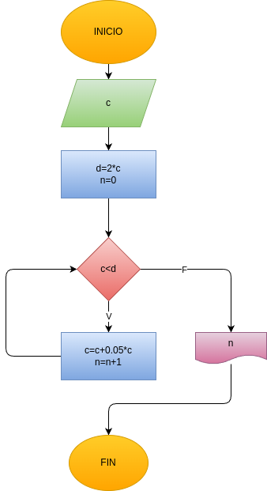

# capital_interes
Programa en Python para ingresar un capital e imprimir en cuantos meses se duplica según un interés compuesto del 5%

## Anĺisis

### Variables de entrada
- c = capital

### procesamiento
while(c<d):

    c=1.05*c
    n=n+1
    print(c)

## Diseño

## Construcción

Está en el archivo capital_interes.py

